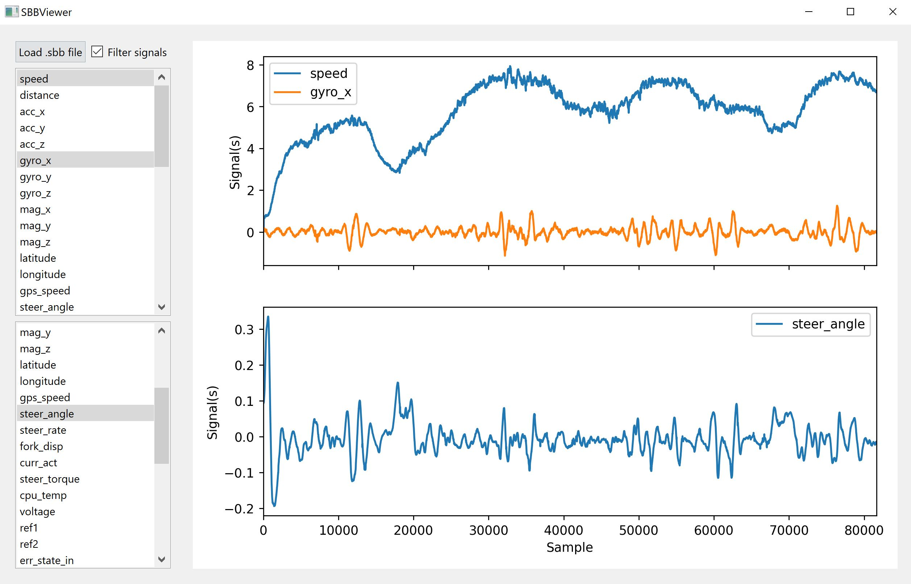

# SBBViewer

PySide6 application to view .sbb files logged from the self-balancing bicycle.

## Requirments

* Python >= 3.10
* PySide6 >= 6.5.1
* Numpy >= 1.21.6
* Matplotlib >= 3.5.3
* Scipy >= 1.1.1

You can install easily the Python requirements (PySide6 and scipy) using `pip` with

```
pip install -r requirements.txt
```

The following modules are already included in Python

* json
* sys

The repository contains the following files: 

* `main.py`: main Python script
* `sbbviewer.py`: Python class for the GUI using PySide6
* `settings.json`: setting file

## Getting started

After installing the requirements, you can just run the main script with

```
python main.py
```

You can use the pushbutton "Load .sbb files" to load the log file. Be sure that the signals contained in the log are consistent with those defined in the setting file. In the GUI there are two plots: you can plot the signals just by selecting one or more of them from the listboxes on the left.




